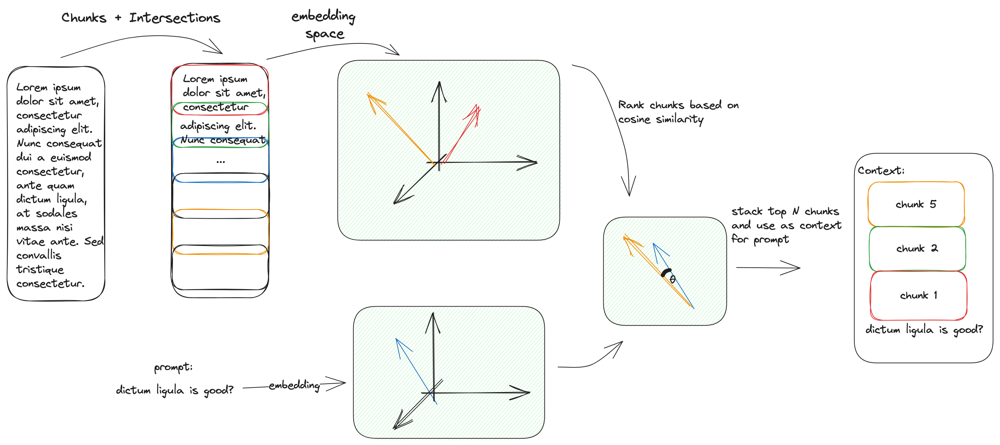

# <h1 align='center'>:crystal_ball: Talk to a URL :crystal_ball:</h1>

<p align='center'> Use an LLM to answer questions based on a specific URL. </p>
<p align='center'> </p>

# Installation 

```
pip install -r requirements.txt
```

Notes: make sure you're able to install [llama-cpp-python](https://github.com/abetlen/llama-cpp-python) package.

# Example usage: 

In one terminal, run the flask application: 
```
python run
```

Use another terminal (or postman) to make the requests: 
```
curl -X POST -H "Content-Type: application/json" -d '{"url": "https://en.wikipedia.org/wiki/Brazil"}' http://localhost:4000/v1/index_url

{
  "message": "URL https://en.wikipedia.org/wiki/Brazil has been indexed. 177239 letters was divided into 120 chunks."
}
```

> Notes: `index_url` is currently implemented with the `multiprocessing` feature. It uses up to 8GB RAM per process, so make sure you have enough or specify N_PROCESS=1 in the config file. It may also produce some overhead if the website is relatively small.

```
curl -X POST -H "Content-Type: application/json" -d '{"url": "https://en.wikipedia.org/wiki/Brazil", "question":"When was the Treaty of Tordesillas?"}' http://localhost:4000/v1/ask

{
  "response":"The Treaty of Tordesillas was signed in 1495."
}
```

Here's a single log for the above run: 
```log
Initializing Database
Initializing Instructor model for embeddings
Initializing LLM at /Users/andreaguiar/Desktop/usr/dev/llm/talk-to-url/data/llama-2-7b-chat.ggmlv3.q2_K.bin with 4096
Indexing https://en.wikipedia.org/wiki/Brazil
https://en.wikipedia.org/wiki/Brazil content extracted: 177239 words
https://en.wikipedia.org/wiki/Brazil added to DB
https://en.wikipedia.org/wiki/Brazil has 58822 total tokens
https://en.wikipedia.org/wiki/Brazil was separated into 120 chunks
Initializing Database
Initializing Instructor model for embeddings
Initializing LLM at /Users/andreaguiar/Desktop/usr/dev/llm/talk-to-url/data/llama-2-7b-chat.ggmlv3.q2_K.bin with 4096
https://en.wikipedia.org/wiki/Brazil has embeddings stored in DB with 120 keys
Preparing to compare prompt against 120 chunks...
Embedding prompt for comparison against chunks
Best cosine similarity is: [0.617396]
Stacked 6 chunks together
Total number of letters stacked: 10811
Total number of tokens stacked: 3453
Answer: Using only information from the following piece text, answer the question.
     Don't make up any information. If you can't find the answer, simply state "Could not find the answer".
     Only use information from the piece of text.
     Context:'
b' Skidmore, pp.\xc2\xa0209\xe2\x80\x93210\n\n^ Skidmore, p.\xc2\xa0210\n\n^ Fausto (2005), p.\xc2\xa0397\n\n^ Gaspari, A Ditadura Envergonhada, pp. 141\xe2\x80\x9342.\n\n^ Gaspari, A Ditadura Envergonhada, p.\xc2\xa035.\n\n^ Crocitti & Vallance (2012), p.\xc2\xa0395, last paragraph.\n\n^ Richard Young, Odile Cisneros "Historical Dictionary of Latin American Literature and Theater" Scare Crow Press 2011, p. 224, 2nd \xc2\xa7 View on Google Books\n\n^ Laurence Burgorgue-Larsen & Amaya \xc3\x9abeda de Torres "The Inter-American Court of Human Rights: Case Law and Commentary" Oxford University Press 2011 ISBN\xc2\xa0978-0-19-958878-7 p. 299 View on Google Books\n\n^ Crocitti & Vallance (2012), p.\xc2\xa0396.\n\n^ Crocitti & Vallance (2012), p.\xc2\xa0395\xe2\x80\x9397.\n\n^ Bradford Burns 1993, p. 457\n\n^ Fausto (1999), Chapter 6 "The military government and the transition to democracy (1964\xe2\x80\x931984)".\n\n^ Fausto (2005), pp.\xc2\xa0464\xe2\x80\x9365.\n\n^ Fausto (2005), pp.\xc2\xa0465, 475.\n\n^ Skidmore, p.\xc2\xa0311.\n\n^ Fausto (1999), Epilogue.\n\n^ Fausto (2005), p.\xc2\xa0482.\n\n^ Fausto (2005), p.\xc2\xa0474.\n\n^ Fausto (2005), p.\xc2\xa0502.\n\n^ Zirin, 2014. Chapter 3\n\n^ "Global protest grows as citizens lose faith in politics and the State" article on "the'
b'119] and military.[120][121][122]\nLittle by little, a cycle of general instability sparked by these crises undermined the regime to such an extent that in the wake of the murder of his running mate, the defeated opposition presidential candidate Get\xc3\xbalio Vargas, supported by most of the military, successfully led the Revolution of 1930.[123][124] Vargas and the military were supposed to assume power temporarily, but instead closed down Congress, extinguished the Constitution, ruled with emergency powers and replaced the states\' governors with his own supporters.[125][126]\nIn the 1930s, three attempts to remove Vargas and his supporters from power failed. The first was the Constitutionalist Revolution in 1932, led by the S\xc3\xa3o Paulo\'s oligarchy. The second was a Communist uprising in November 1935, and the last one a putsch attempt by local fascists in May 1938.[127][128][129] The 1935 uprising created a security crisis in which Congress transferred more power to the executive branch. The 1937 coup d\'\xc3\xa9tat resulted in the cancellation of the 1938 election and formalized Vargas as dictator, beginning the Estado Novo era. During this period, government brutality and censorship of the press increased.[130]\nDuring World War II, Brazil remained neutral until August 1942, when the country suffered retaliation by Nazi Germany and Fascist Italy in a strategic dispute over the South Atlantic, and, therefore, entered the war on the allied side.[131][132][133] In addition to its participation in the battle of the Atlantic, Brazil also sent an expeditionary force to fight in the Italian campaign.[134]\nWith the Allied victory in 1945 and the end of the fascist regimes in Europe, Vargas\'s position became unsustainable, and he was swiftly overthrown in another military coup, with democracy "reinstated" by the same army that had ended it 15 years earlier.[135] V'
b' November 1889, in disagreement with the majority of the Imperial Army officers, as well as with rural and financial elites (for different reasons), the monarchy was overthrown by a military coup.[102] A few days later, the national flag was replaced with a new design that included the national motto "Ordem e Progresso", influenced by positivism. 15 November is now Republic Day, a national holiday.[103]\n\nEarly republic\nProclamation of the Republic, 1893, oil on canvas by Benedito CalixtoGet\xc3\xbalio Vargas (center) during the Revolution of 1930Brazilian soldiers in Massarosa, Italy, September 1944. Brazilian Expeditionary Force was the largest Latin American military force in World War II.\nMain articles: First Brazilian Republic, Vargas Era, and Second Brazilian Republic\nThe early republican government was a military dictatorship, with the army dominating affairs both in Rio de Janeiro and in the states. Freedom of the press disappeared and elections were controlled by those in power.[104] Not until 1894, following an economic crisis and a military one, did civilians take power, remaining there until October 1930.[105][106][107]\nIf in relation to its foreign policy, the country in this first republican period maintained a relative balance characterized by a success in resolving border disputes with neighboring countries,[108] only broken by the Acre War (1899\xe2\x80\x931902) and its involvement in World War I (1914\xe2\x80\x931918),[109][110][111] followed by a failed attempt to exert a prominent role in the League of Nations;[112] Internally, from the crisis of Encilhamento[113][114][115] and the Navy Revolts,[116] a prolonged cycle of financial, political and social instability began until the 1920s, keeping the country besieged by various rebellions, both civilian[117][118][119] and military.[120][121][122]\n'
b"0s, in Maranh\xc3\xa3o during the 1610s, and the Dutch in Bahia and Pernambuco, during the Dutch\xe2\x80\x93Portuguese War, after the end of Iberian Union.[76]\nThe Portuguese colonial administration in Brazil had two objectives that would ensure colonial order and the monopoly of Portugal's wealthiest and largest colony: to keep under control and eradicate all forms of slave rebellion and resistance, such as the Quilombo of Palmares,[77] and to repress all movements for autonomy or independence, such as the Minas Gerais Conspiracy.[78]\n\nElevation to kingdom\nMain article: United Kingdom of Portugal, Brazil and the Algarves\nSee also: Invasion of Portugal (1807) and Transfer of the Portuguese court to Brazil\nThe Acclamation of King Jo\xc3\xa3o VI of the United Kingdom of Portugal, Brazil and the Algarves in Rio de Janeiro, 6 February 1818\nIn late 1807, Spanish and Napoleonic forces threatened the security of continental Portugal, causing Prince Regent John, in the name of Queen Maria I, to move the royal court from Lisbon to Rio de Janeiro.[79] There they established some of Brazil's first financial institutions, such as its local stock exchanges[80] and its National Bank, additionally ending the Portuguese monopoly on Brazilian trade and opening Brazil's ports to other nations. In 1809, in retaliation for being forced into exile, the Prince Regent ordered the conquest of French Guiana.[81]\nWith the end of the Peninsular War in 1814, the courts of Europe demanded that Queen Maria I and Prince Regent John return to Portugal, deeming it unfit for the head of an ancient European monarchy to reside in a colony. In 1815, to justify continuing to live in Brazil, where the royal court had thrived for six years, the Crown established the United Kingdom of Portugal, Brazil and the Algarves, thus creating a pluricontinental transatlantic monarchic state.[82] However, the leadership in Portugal, resentful of the new status of its larger colony, continued to demand the return of the court to Lisbon (see Liberal"
b" new Emperor could not exert his constitutional powers until he came of age, a regency was set up by the National Assembly.[93] In the absence of a charismatic figure who could represent a moderate face of power, during this period a series of localized rebellions took place, such as the Cabanagem in Gr\xc3\xa3o-Par\xc3\xa1, the Mal\xc3\xaa Revolt in Salvador, the Balaiada (Maranh\xc3\xa3o), the Sabinada (Bahia), and the Ragamuffin War, which began in Rio Grande do Sul and was supported by Giuseppe Garibaldi. These emerged from the provinces' dissatisfaction with the central power, coupled with old and latent social tensions peculiar to a vast, slaveholding and newly independent nation state.[94] This period of internal political and social upheaval, which included the Praieira revolt in Pernambuco, was overcome only at the end of the 1840s, years after the end of the regency, which occurred with the premature coronation of Pedro II in 1841.[95]\nDuring the last phase of the monarchy, internal political debate centered on the issue of slavery. The Atlantic slave trade was abandoned in 1850,[96] as a result of the British Aberdeen Act and the Eus\xc3\xa9bio de Queir\xc3\xb3s Law, but only in May 1888, after a long process of internal mobilization and debate for an ethical and legal dismantling of slavery in the country, was the institution formally abolished with the approval of the Golden Law.[97]\nThe foreign-affairs policies of the monarchy dealt with issues with the countries of the Southern Cone with whom Brazil had borders. Long after the Cisplatine War that resulted in the independence of Uruguay,[98] Brazil won three international wars during the 58-year reign of Pedro\xc2\xa0II: the Platine War, the Uruguayan War and the devastating Paraguayan War, the largest war effort in Brazilian history.[99][100]\nAlthough there was no desire among the majority of Brazilians to change the country's form of government,[101] on 15 November 1889, in disagreement with the majority of the Imperial Army officers,"
b' em 2022". Valor. 20 May 2021. Archived from the original on 5 August 2021. Retrieved 5 August 2021.\n\n^ "An\xc3\xa1lise das Elei\xc3\xa7\xc3\xb5es 2022: Veja Detalhes dos Resultados da Vota\xc3\xa7\xc3\xa3o". noticias.uol.com.br (in Portuguese). Archived from the original on 30 October 2022. Retrieved 31 October 2022.\n\n^ "Resultados \xe2\x80\x93 TSE". resultados.tse.jus.br. Archived from the original on 2 November 2022. Retrieved 31 October 2022.\n\n^ Phillips, Tom (8 January 2023). "Jair Bolsonaro supporters storm Brazil\'s presidential palace and supreme court". The Guardian. Archived from the original on 8 January 2023.\n\n^ Rocha, Lucas. "Manifestantes furam bloqueio, entram na Esplanada e invadem o Congresso Nacional" [Protesters break through the blockade, enter the Esplanade and invade the National Congress]. CNN Brazil. Archived from the original on 8 January 2023. Retrieved 8 January 2023.\n\n^ "Lula decreta interven\xc3\xa7\xc3\xa3o federal na seguran\xc3\xa7a do DF e diz que terroristas ser\xc3\xa3o punidos" [Lula decrees federal intervention in the security of the DF and says that terrorists will be punished]. CartaCapital (in Brazilian Portuguese). 8 January 2023. Archived from the original on 8 January 2023.\n\n^ a b "Land and Resources". Encarta. MSN. Archived from the original on 28 October 2009. Retrieved 11 June 2008.[dubious  \xe2\x80\x93 discuss]\n\n^ Official Area (In Portuguese) Archived 6 January 2012 at the Wayback Machine IBGE: Instituto Brasileiro de Geografia e Estat\xc3\xadstica. Retrieved 8 January 2010.\n\n^ "Hora Legal Brasileira". Observat\xc3\xb3rio Nacional. Archived from the original on 22 July''
     Question: When was the Treaty of Tordesillas?
     Only return the helpful answer below and nothing else.
     Answer: The Treaty of Tordesillas was signed in 1495.

```


# Known Issues and TODOs: 

- [ ] llm, embedding instructor, db are being initialised more than necessary;
- [ ] multiprocessing may bring overhead, maybe for now best strategy would be to remove it;
- [ ] number of chunks to stack is a config and could be misused - create automatic chunk size or simply cap at max_tokens for chunks sorted by semantic similarity.
- [ ] streaming version of /ask does not work - create a separate endpoint for that
- [ ] expand crawler to go into websites' links and use that info (maybe in a bfs manner up to some configured depth)
- [ ] finish docker implementation (include llm model path)
- [ ] create vectorizer class instead of directly using the instructor
