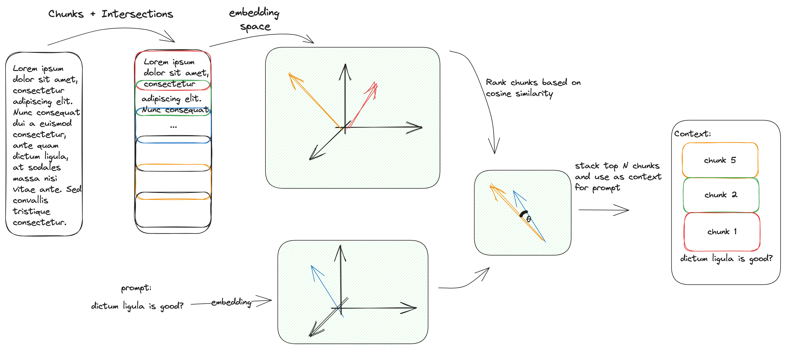

Approach to handle context length issues
========================================

The general idea is: we can't feed the whole content of the website because there's a limitation on number of tokens.

The workaround I thought was:
- divide the whole content into chunks of size < max_tokens allowed
- create embeddings for each chunk (store it in the db for later usage)
- create embeddings for prompt
- calculate similarity (cosine) between prompt and each chunk
- select top K closest chunks and stack them together
- use the stacked chunks as the context input

Note: It is important to properly handle configurations such that max_tokens for each chunk and number of chunks stacked
won't surpass the LLM token limit.

Note: this is done in the `index_url` (I was initially doing it in `ask` but realised this step may take a lot of time,
in which case it's better to do once)

Intersection
------------

I've added some intersection to each adjacent chunk so as to try to avoid losing important pieces of connected information.

Embeddings
----------

Initially, I have used LLAMA 2 itself to generate the embeddings of the given chunks,
however, embeddings were generated on a very impractical rate of no more than 10 token/s.

I've tried to parallelize the computation using `multiprocessing`. However, main bottleneck was not I/O. Probably,
the next best strategy here would be to fix the installation of llama-cpp-python to make a better usage of apple's M1 chip.

The best solution was to look for another transformer. I've ended up using Instructor transformer
(which may guide the embedding space based on an instruction). This ended up

Here, there's an opportunity to refactor so as to make the 'embedder' (or vectorizer) concept general as well.

Cosine Similarity
-----------------

TODO

Heapq
-----

A priority queue (max heap) was used to keep track of the chunks with highest cosine similarity.
The top K chunks were stacked together and used as an input to the LLM.

Possible alternatives
---------------------

I have tried
- directly using the content of the website, obtained 'max prompt length'
-  using the chunk with maximum similarity as the context for the question

I haven't tried
- Apply text generation for all chunks together and come up with a confidence score to decide which one to choose
